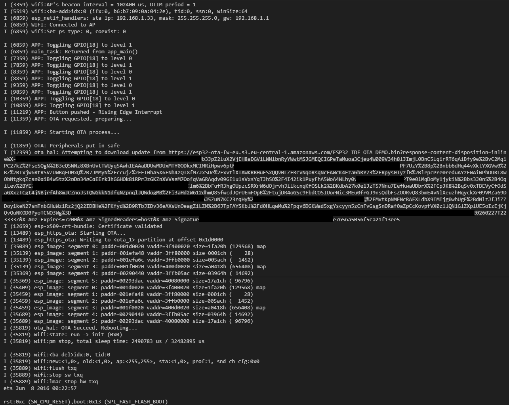

# ESP32 ESP-IDF OTA Demo

📟 Embedded application (ESP-IDF) that connects an **ESP32** to Wi-Fi, runs a simple “normal operation” task (LED toggle),
and performs **HTTPS OTA firmware upgrade** when a **button interrupt** is triggered.

Designed as a practical OTA example:
**Clone → Configure → Build → Flash → Trigger OTA → Verify new firmware**.

---

## 🚀 Features
- ✅ Wi-Fi STA connection (SSID/PW configurable via `menuconfig`)
- ✅ HTTPS OTA update using ESP-IDF OTA APIs
- ✅ OTA triggered by a **GPIO button interrupt**
- ✅ “Normal operation” task toggling an LED (GPIO configurable)
- ✅ Menuconfig options for:
  - OTA firmware URL (`CONFIG_FIRMWARE_UPGRADE_URL`)
  - Button GPIO + pullup/pulldown + interrupt edge
  - Output GPIO (LED)
  - LED toggle frequency (ms)

---

## 🚀 Code Features
- ✅ Clean project structure (ESP-IDF CMake)
- ✅ Wi-Fi module separated (`main/wifi.*`)
- ✅ OTA abstraction layer (`main/ota_hal.*`)
- ✅ Clear separation between:
  - normal operation task
  - OTA handling task (triggered by button)
- ❌ missing GPIO abstraction layer
- ❌ missing task/scheduler layer

---

## 🔧 Requirements
- Microcontroller: **ESP32**
- Framework: **ESP-IDF**
- Language: **C**
- Toolchain options:
  - ESP-IDF CLI (`idf.py`)
  - VS Code + ESP-IDF extension (optional)

Hardware:
- Any ESP32 board
- 1× button connected to a GPIO (or on-board BOOT/USER button if available).In this application GPIO 13 is used.
- 1× LED (on-board or external) on a configurable GPIO.In this application GPIO 18 is used.

Network:
- Wi-Fi 2.4 GHz
- An **HTTPS** endpoint hosting a firmware `.bin` file reachable by the ESP32

## 🏗️ Hardware Setup
Application and ESP32 require to be connected to: 1xLED and 1x Button. Here a possible working scenario:


| ESP32 pin | Button |
|:-----------:|:------------:|
| GND    | 1 |
| D13    | 4 |
Button is configured on release then transition from GND to 3.3V. Detail on configuration available in scheme "images\ESP32_btn_setup.png".

| ESP32 NodeMCU pin | Diode LED pin |
|:-----------:|:------------:|
| D4      | A |
| GND    | K |

Anode pin requires 1K series resistor.
---

## 🏗️ Project Structure
```text
ESP32_IDF_OTA_demo/
├─ main/
│  ├─ main_app.c           # app entry + tasks + button ISR trigger for OTA
│  ├─ wifi.c / wifi.h      # Wi-Fi init/connect helpers
│  ├─ ota_hal.c / ota_hal.h# OTA helper/HAL (download + flash + reboot)
│  ├─ Kconfig.projbuild    # menuconfig options (OTA + Wi-Fi + GPIO + app)
│  └─ common.h             # logging macro
├─ images/                 # optional screenshots/assets
├─ CMakeLists.txt
├─ sdkconfig               # current build config (can be customized)
```

## ⚙️ Quick Start (Clone → Build → Flash)

### 1) Clone
```bash
git clone https://github.com/<YOUR_ACCOUNT>/<YOUR_REPO>.git
cd ESP32_IDF_OTA_demo
```
### 2) Set target (first time only)
Example for ESP32 you can use bash command as follow or ESP-IDF extension:
```bash
idf.py set-target esp32
```
### 3) Configure Wi-Fi + OTA + GPIO

Open menuconfig and set:

*WIFI CONFIG*
- `WiFi SSID → your SSID`
- `WiFi Password → your password`
- `WiFi Max Retry → default 5'`

*OTA CONFIG*
- `firmware upgrade url endpoint → https://<HOST>/<PATH>/firmware.bin`
- `Enable certificate bundle → enabled (recommended)`

*GPIO CONFIG*
- `Button GPIO number → default 13 (change if needed)`
- `Enable internal pull-up or pull-down for button → choose based on wiring`
- `Button interrupt type → rising/falling edge (match button logic)`
- `Output GPIO number → default 18 (LED pin)`

*APP CONFIG*
- `Toggle LED frequency (ms) → default 500`


### 4) Build, Flash, Monitor
```bash
idf.py build flash monitor
```
Moreover, you can use ESP-IDF extension to build flash and monitor

## 🧪 Expected Behavior

After boot and Wi-Fi connection, the LED toggles continuously at the configured frequency.
Press the configured button.

The application starts the OTA procedure:

- connects to the configured HTTPS URL
- downloads the new firmware image
- writes to the OTA partition
- sets the boot partition
- reboots into the new firmware

## 🌐 OTA Firmware Hosting Notes

The URL must point to a valid ESP-IDF firmware binary (typically a .bin produced by idf.py build).
OTA over HTTPS requires valid server certificates.
Recommended approach: keep Enable certificate bundle enabled and use a public HTTPS endpoint with a valid certificate chain.
Tip: For production-grade OTA, you usually publish firmware binaries on a controlled HTTPS server (or CDN) and version them.

## 🗒️ Test and Results
This demonstration show, with flashing, how toggle LED frequency changes from 500ms to 1000ms. 
Here was used Amazon Web Services - Bucket S3 to upload the .bin file to be flashed.

1. Flash the application in your ESP32
2. Open serial monitor (idf.py monitor) where you can find your **ESP_IP**
3. Device connects to Wi-Fi (look for “Connected to AP” and an IP assignment line)
4. Push the button to start flashing
5. Procedure will start and with positive result the toggle LED frequency will change:

6. otherwise, with negative result, application rollback to previous status


## 🛠️ Troubleshooting
**Wi-Fi won’t connect**
- Re-check SSID/password in menuconfig
- Ensure network is 2.4 GHz
- Increase retries (WIFI_MAX_RETRY)

**OTA fails with TLS / certificate errors**
- Ensure you are using HTTPS
- If using certificate bundle, make sure the server certificate is valid and trusted
- Avoid captive portals / guest networks with restrictions

**Button doesn’t trigger OTA**
- Verify Button GPIO number matches your wiring/board
- Check selected interrupt edge (rising vs falling)
- Check pull-up/pull-down configuration


## 🗒️ Licensing
This project is under Apache 2.0 License. See the LICENSE file for details.
Additional functionality was added by Marconatale Parise in June 2025, including:
- Data structure to extrapolate sensor data. 
- Function to improve the code readability and for debug

Custom code for variables and constant are marked with:
```c
/* === Added by Marconatale Parise for.. [description of the new code] === */
```

Custom code for function are marked specifying the author (@author Marconatale Parise) in the description.

## 🌐 Contatti
[](mailto:marconatale.parise@gmail.com)  
[](https://www.linkedin.com/in/marconatale-parise-48a07b94)  
[](https://github.com/MpDev89)